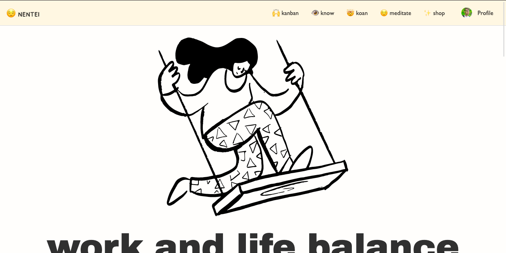
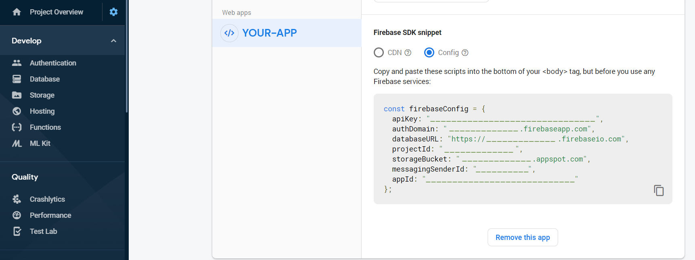

# nentei

nentei is an Angular PWA powered by Firebase.

- [Live Demo](https://nentei.web.app/)



## Features

- Angular 9.x + Firebase
- Installable PWA
- Angular Material + Theme
- OAuth Signup with Firebase
- CRUD cards with Firestore

## Usage

1.  Run

- `git clone https://github.com/davidmimay/nentei.git nentei`
- `cd nentei`
- `npm install`

2.  Create a project at https://firebase.google.com/ and grab your web config:



3.  Add the config to your Angular environment

#### src/environments/

Update the `environment.prod.ts` and `environment.ts` files. 

```typescript
export const environment = {
  production: false,
  firebase: {
    apiKey: 'APIKEY',
    authDomain: 'DEV-APP.firebaseapp.com',
    databaseURL: 'https://DEV-APP.firebaseio.com',
    projectId: 'DEV-APP',
    storageBucket: 'DEV-APP.appspot.com',
    messagingSenderId: '...',
    appId: '...',
  }
};
```

5.  Run `ng serve`.

## Source

This project was made from https://fireship.io video lessons and courses. A highly recommended platform.

- [Source code](https://github.com/codediodeio/angular-firestarter)
- [Learn more](https://firestarter.fireship.io/)

## 🔥 Firestore
### Boards

```
boards
+ boardId
++ uid
++ tasks
+++ 0
+++++ description, label
+++ 1
+++++ description, label
```

```
know
+ board1
++ question
++ [users]
+++ uid
+++ tasks
++++ 0
+++++ description, label
++++ 1
+++++ description, label
```

## 💻 Developing

🟠  Question boards to know yourself, with dragable lists items.